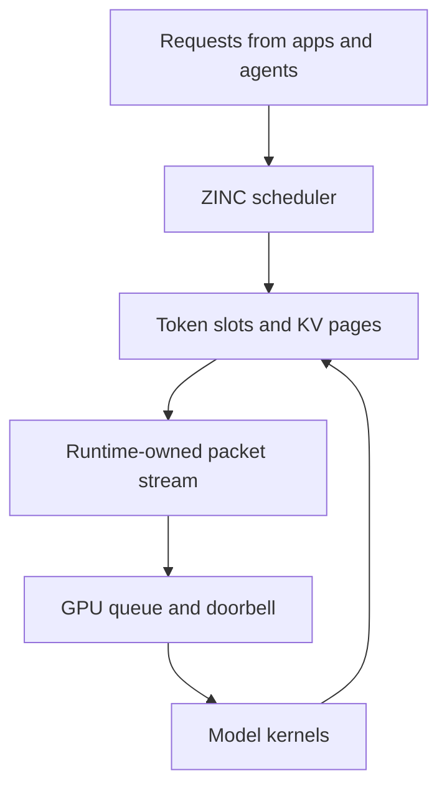

The uncomfortable number is 35 tokens per second.

That is where ZINC_RT stands right now on the current RDNA4 test loop for the Qwen3.6 35B MoE model. The same machine, same model, and same prompt through the Vulkan backend sits around 109 to 112 tokens per second. If this were only a scoreboard, the conclusion would be easy: keep Vulkan, delete the experiment, move on.

But that would miss the point.

ZINC_RT is not being built because we forgot Vulkan exists. It is being built because the shape of local inference is changing. A local model runtime is no longer just a way to launch matrix kernels. It is becoming a scheduler, a memory manager, a queueing system, a tenant isolation layer, a KV cache owner, and a policy engine for how independent pieces of software share one GPU without turning latency into a lottery.

That is the layer ZINC_RT is trying to own.

## Where we stand

The production path in ZINC is still Vulkan. It is faster, more complete, and the number we compare against when we want to know whether a change matters. ZINC_RT is still an opt-in runtime under active bring-up.

The recent RDNA loop was useful because it separated three things that often get blurred together in early GPU runtime work:

| Path | Current result | What it means |
| --- | ---: | --- |
| Vulkan backend | ~109-112 tok/s | Production baseline on the current node |
| ZINC_RT host-assisted path with consumed CS model slices | ~35.2 tok/s | Correctness and integration proof |
| ZINC_RT forced CPU tier | ~35.4 tok/s | The current GPU slices are not yet the throughput driver |

That last line matters. There are real GPU submissions in the path. The harness now reports evidence such as consumed model values, real model slices, and shortcut-free execution. It is not just timing a marker and pretending a model ran. But the current consumed slices are too small, too synchronized, and too host-assisted to move end-to-end token throughput.

In other words: the proof is real, but the design is not yet fast.

That is progress, because this is exactly the point at which a fake benchmark usually falls apart. If a runtime only gets faster when it removes real work, it is not a runtime. It is a demo. The current ZINC_RT loop has become strict enough to reject that class of improvement.

## The problem is not one more shader

The obvious way to approach local LLM performance is kernel by kernel: make matmul faster, fuse normalization, reduce copies, improve attention. Those all matter, and ZINC has spent a lot of time there.

But serving a model is not just a kernel sequence anymore.

A single-user benchmark asks a simple question: how fast can one prompt generate tokens when nothing else is happening? A real local machine asks a messier one: how should the GPU be shared between a chat UI, an agent loop, background summarization, tool calls, embeddings, evals, and two other users on the same box?

The local inference stack needs to answer questions like these:

- Which requests are allowed to join the next decode step?
- Which tenant owns which KV pages?
- Which prefixes can be shared safely?
- How do we bound tail latency when one request has a long context?
- How do we batch without making interactive requests feel stuck?
- How do we avoid turning every token into a round trip through a heavyweight host stack?

These are runtime questions. They are not solved by adding one more shader.

Vulkan is a capable compute backend, and for ZINC today it remains the best production path. But Vulkan is still a graphics-shaped API. It gives us a portable way to record work, submit work, synchronize work, and manage resources. It does not naturally give us a token scheduler, a KV page allocator, a multitenant admission controller, or a persistent model loop that treats decode as the unit of execution.

ZINC_RT exists because those pieces should be first-class.

The important part of this diagram is not the queue by itself. It is the loop. The scheduler, KV cache, packet stream, and GPU completion model have to become one system if local inference is going to behave like infrastructure instead of a benchmark script.

## What the last loop taught us

The recent RDNA work produced a useful negative result: recurring tiny substitutions through the current command-submission path are throughput-dead.

We can dispatch real row-range model slices through `DRM_IOCTL_AMDGPU_CS`. The runtime can consume their output. The harness can verify that the values affect the model path. But doing this at high cadence adds enough synchronization and submission overhead that it does not help the token loop. In some experiments it made the run much worse.

That is why the current numbers look strange at first glance. The ZINC_RT path with direct compute evidence lands around the same speed as the forced CPU tier. Every-token direct LM-head cadence measured slower. Broad recurring direct slices measured much slower. Router and MoE cadence experiments also did not create a win.

That is not the result we wanted, but it is the result we needed.

It says the next milestone is not "sprinkle more CS calls into the model." The next milestone is a real queue-retired path: submit work through the runtime, ring the doorbell, and observe completion through a shader-written signal with bounded polling. Until that exists, every attempt to force more tiny GPU slices through a host-heavy path risks measuring submission overhead instead of model execution.

We also learned that the fast path is gated by the node and kernel configuration. The T2 user-mode queue path is blocked on this machine because compute user-queue slots are not exposed. That does not invalidate the design, but it changes the immediate plan. On this node the next useful T1 step is not another fake queue admission milestone. It is a minimal KFD doorbell-retire smoke test that proves the runtime can own the lifecycle of a tiny compute packet end to end.

## What comes next

There are three near-term goals.

First, ZINC_RT needs a real doorbell-retired compute proof. The smallest useful test is intentionally boring: create the queue, map the doorbell, submit a tiny packet, have the shader write a host-visible signal, ring the doorbell, and poll that signal with a timeout. No model. No benchmark theater. Just proof that the runtime can drive and retire work without leaning on the old submission path.

Second, the runtime needs to move from "real slices" to useful slices. A model slice that proves correctness but costs too much to submit is not enough. The work has to be large enough, resident enough, and scheduled well enough that GPU time dominates host cost. That means resident weights, better batching of row ranges, and fewer fences per token.

Third, ZINC_RT needs to climb from single-token proof work toward the thing it was designed for: continuous, multitenant decode. The target is not just "one prompt faster." The target is many active requests sharing the same model, KV allocator, and decode loop while the runtime makes explicit choices about fairness, latency, and throughput.

That is the difference between a backend and a serving runtime.

## Why this matters beyond ZINC

Local inference is still mostly discussed as a personal productivity feature: download a model, run a chat, avoid sending data to a cloud API. That is real, but it is too small a vision.

The more interesting future is that local inference becomes a local service. Your editor uses it. Your browser uses it. Your terminal uses it. A background agent uses it. A search indexer uses it. A small office server uses it for several people. A lab machine uses it for experiments. A home server uses it for automation. In that world, the hard problem is not whether a model can produce one impressive answer. The hard problem is whether the machine can serve many small pieces of intelligence predictably.

Datacenter inference stacks already know this. They think in batches, tenants, pages, queues, admission control, preemption, and utilization. Local inference needs the same concepts, but it cannot assume a datacenter stack. It has to run on workstation GPUs, consumer drivers, mixed workloads, constrained VRAM, and machines where installing a giant vendor stack is often the first failure mode.

That is especially important for AMD.

AMD hardware has the memory bandwidth, VRAM capacity, and price/performance profile to matter a lot for local inference. But the software path is fragmented. Vulkan gets us surprisingly far, and ROCm can be powerful in the environments where it fits. There is still a gap for a small, direct, inference-shaped runtime that treats AMD GPUs as serving hardware without requiring the whole application to inherit a datacenter software model.

ZINC_RT is an attempt to fill that gap.

Not by pretending graphics APIs are useless. They are not. Vulkan got ZINC to a working, measurable, useful backend. The lesson is narrower and more practical: once the application becomes a scheduler and a memory manager, the runtime boundary has to move down. Token scheduling, KV ownership, model residency, queue submission, and completion signaling should not live in five loosely connected layers that only meet through generic API calls.

They should be designed together.

## The honest status

ZINC_RT is behind Vulkan today.

That is the honest status. The current RDNA4 loop is around one third of Vulkan throughput on the same run. The direct slices are real, but they are not yet useful enough. The user-mode queue path is blocked on this node. The KFD path needs a real doorbell-retired proof before it deserves to be called a direct runtime path.

The encouraging part is that the work has become falsifiable. We now have harnesses that catch wrong-device baselines, distinguish Vulkan from ZINC_RT, force CPU tiers, verify consumed GPU model values, reject shortcut paths, and record when a promising idea is actually slower. That is not glamorous, but it is how a runtime stops being a story and starts becoming engineering.

The next good ZINC_RT result will not be a magic jump from 35 tok/s to 110 tok/s. It will probably be smaller and more important: one direct queue path that retires correctly, one resident slice that beats the host equivalent, one decode segment that can be scheduled without a per-token host tax, one batching step that makes multiple tenants cheaper than serial execution.

Those are the pieces that compound.

The industry does not need another local LLM demo that is fast in a clean terminal and fragile everywhere else. It needs runtimes that understand that inference is becoming shared infrastructure. ZINC_RT is early, slower than it needs to be, and still finding the right hardware path.

But it is aimed at the layer that decides whether local inference becomes infrastructure at all.
